# Password Reset Feature Design

**Date:** 2026-03-28
**Status:** Approved

## Overview

Add a secure password reset feature that allows users to reset their password via email link. Uses token-based approach with 24-hour expiration for security.

## Architecture

### API Endpoints
- `POST /api/auth/request-reset` - Request password reset (generates token and sends email)
- `GET /api/auth/reset-password?token=xxx` - Password reset page (validates token, allows new password)
- `POST /api/auth/reset-password` - Update password (validates token, updates database)

### Database Schema Changes
Add to `users` table:
- `resetToken: text('reset_token')` - Temporary token for password reset
- `resetTokenExpiresAt: text('reset_token_expires_at')` - Token expiration (24 hours)

### Email Flow
1. User requests reset via email or form (future: add form)
2. System generates secure token (24-hour expiry)
3. Email sent with link: `${BASE_URL}/reset-password?token=xxx`
4. User clicks link
5. System validates token and user identity
6. User sets new password
7. Password updated in database, token cleared

## Components

### Backend Components
- Token generation utility (crypto, random string)
- Token validation middleware
- Password reset endpoint
- Token verification endpoint
- Password update service

### Frontend Components (Future)
- Request reset form/page
- Reset password form/page
- Confirmation messages

## Data Flow

```dot
digraph data_flow {
    "User requests reset" [shape=box];
    "Generate token" [shape=box];
    "Save token to DB" [shape=box];
    "Send email with token link" [shape=box];
    "User clicks email link" [shape=box];
    "Validate token" [shape=box];
    "User enters new password" [shape=box];
    "Hash password" [shape=box];
    "Update password in DB" [shape=box];
    "Clear reset token" [shape=box];
}
```

## Error Handling

- Invalid/expired tokens: Clear error message
- Email not found: Security-focused message (doesn't reveal if email exists)
- Password too weak: Minimum 8 characters (existing rule)
- Rate limiting: Prevent abuse (future)
- Token already used: One-time use only

## Testing

- Unit tests for token generation/validation
- Integration tests for API endpoints
- Email delivery verification
- Token expiration handling
- Database constraint testing
